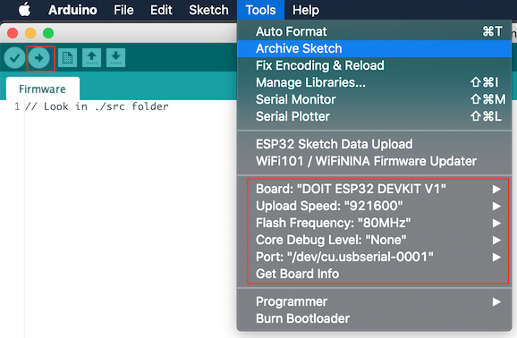
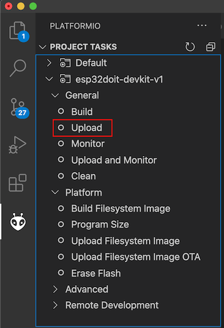

# Postilight firmware Compilation 

## Arduino IDE

### Install libraries : 

- **Stopwatch** ( https://github.com/RobTillaart/Stopwatch_RT) 
- **NeoPixelBus** ( https://github.com/Makuna/NeoPixelBus ) 
- **ArduinoFFT** 

### Postilight Data file upload

### Install plugin  : 

- **arduino-esp32fs-plugin** ( https://github.com/me-no-dev/arduino-esp32fs-plugin )

### Build and Deploy  : 

- Build firmware and Deploy using arduino IDE.

- Deploy Data file with the plugin

---

## In PlatformIo + VSCode: 

Open the folder in VSCode 

- Build firmware 

- Upload Data 

---